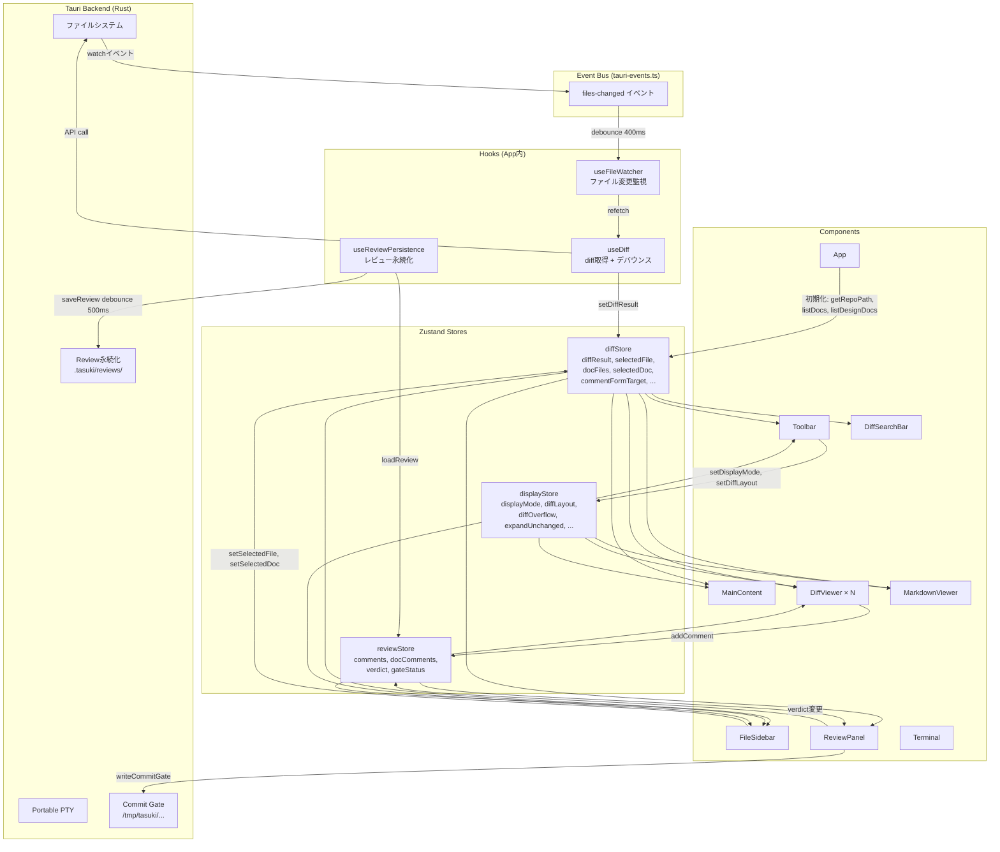
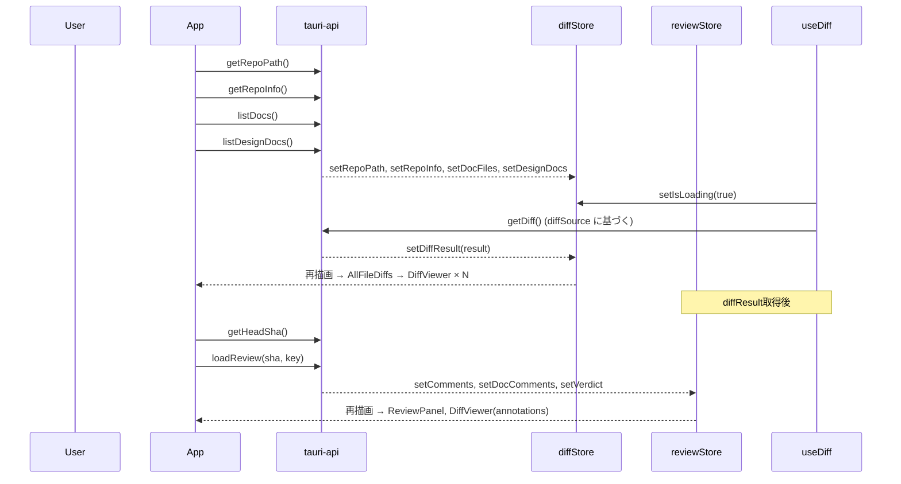

# フロントエンド レンダリングフロー

## 1. コンポーネントツリー (実際のDOMに基づく)

```
ReactDOM.createRoot(#root)
  └─ App
       ├─ hooks: useDiff(), useFileWatcher(), useReviewPersistence()
       ├─ state: sidebarWidth
       │
       └─ WorkerPoolContextProvider  (@pierre/diffs Web Worker管理)
            └─ ErrorBoundary
                 └─ div.app
                      ├─ Toolbar (header.toolbar)
                      │    ├─ div.toolbar-left: タイトル, リポジトリ名, ブランチ名
                      │    ├─ div.toolbar-center: モードタブ (Diff / Split / Viewer)
                      │    └─ div.toolbar-right: 統計, Split/Unified, Scroll/Wrap, Expand/Collapse, Zed
                      │
                      └─ div.app-body
                           ├─ FileSidebar (aside.file-sidebar)
                           │    ├─ [showDocFiles] Add Folder ボタン
                           │    ├─ [showDocFiles] External Folders セクション × N
                           │    ├─ [showDocFiles && docFiles.length > 0] Documents セクション
                           │    ├─ [showDocFiles && designDocs.length > 0] Design Docs セクション
                           │    └─ [showDiffFiles && diffResult] Changed Files セクション
                           │
                           ├─ div.sidebar-resize-handle (ドラッグでサイドバー幅変更)
                           │
                           └─ MainContent
                                │
                                ├── [isViewer] ──────────────────────────────────────────
                                │   main.main-content.viewer-layout
                                │    └─ ResizablePane
                                │         ├─ resizable-left: MarkdownViewer
                                │         ├─ resizable-handle (ドラッグでペイン幅変更)
                                │         └─ resizable-right: div.terminal-slot ← Terminal がここに移動
                                │
                                ├── [!isViewer] ─────────────────────────────────────────
                                │   main.main-content (.split-layout if split)
                                │    ├─ div.split-left (.diff-only if !split)
                                │    │    └─ DiffContentWithSearch
                                │    │         ├─ [searchVisible] DiffSearchBar
                                │    │         └─ div.diff-scroll-container
                                │    │              └─ AllFileDiffs
                                │    │                   └─ div[data-file-path] × N
                                │    │                        └─ ErrorBoundary
                                │    │                             └─ DiffViewer
                                │    │                                  ├─ div.dv-file-header (クリックで折りたたみ)
                                │    │                                  └─ [!isCollapsed] レンダラー (排他):
                                │    │                                       ├─ [added && newFile]  PierreFile
                                │    │                                       ├─ [hasContents]       MultiFileDiff
                                │    │                                       └─ [fallback]          PatchDiff
                                │    │                                            ├─ renderAnnotation()
                                │    │                                            │    ├─ CommentDisplay (保存済みコメント表示)
                                │    │                                            │    └─ CommentFormInline (コメント入力フォーム)
                                │    │                                            └─ renderHoverUtility()
                                │    │                                                 └─ button.dv-hover-comment-btn "+"
                                │    │
                                │    ├─ [isSplit] div.split-handle (ドラッグでペイン幅変更)
                                │    │
                                │    └─ div.split-right  ※ 常にマウント (display:none で非表示)
                                │         ├─ div.right-pane-tabs
                                │         │    ├─ button "Docs"
                                │         │    ├─ button "Terminal"
                                │         │    └─ button "Review"
                                │         └─ div.right-pane-body
                                │              ├─ div.right-pane-content [docs]     → MarkdownViewer
                                │              ├─ div.right-pane-content [terminal] → (Terminal 移動先スロット)
                                │              └─ div.right-pane-content [review]   → ReviewPanel
                                │                   ├─ div.review-panel-header (Copy All, Gate Badge)
                                │                   ├─ [comments.length > 0] ul > CodeCommentItem × N
                                │                   │    └─ ResolveMemoForm (未解決時)
                                │                   ├─ [docComments.length > 0] ul > DocCommentItem × N
                                │                   │    └─ ResolveMemoForm (未解決時)
                                │                   └─ div.review-verdict
                                │                        ├─ 未解決カウント
                                │                        └─ Approve / Reject ボタン
                                │
                                └── Terminal シングルトン (常にマウント) ─────────────────
                                    div[parkingRef] {display:none}  ← 非表示時の退避先
                                     └─ TerminalPanel[terminalRef]
                                          ※ useEffect で以下のスロットに DOM reparenting:
                                          ├─ viewer時  → viewerTermSlotRef (ResizablePane右)
                                          ├─ split+terminal → splitTermSlotRef (right-pane-content)
                                          └─ それ以外  → parkingRef (非表示退避)
```

### 前回のツリーからの修正点

| 項目 | 前回の記述 | 実際のコード |
|------|-----------|-------------|
| `split-right` の表示制御 | `(split時のみ)` と記載 | **常にDOMにマウント**。非split時は `display:none`。Terminal スロットの ref を維持するため |
| Terminal の配置 | ツリーに未記載 | `<main>` と同階層の `div[parkingRef]` に `TerminalPanel` シングルトンが常にマウントされ、useEffect で DOM reparenting |
| サイドバーのセクション順序 | 未詳細 | Add Folder → External Folders → Documents → Design Docs → Changed Files の順 |
| Viewer モードの右ペイン | `Terminal (DOM reparenting)` | `div.terminal-slot[ref]` — Terminal 自体ではなくスロット div。Terminal は parking から移動 |
| DiffViewer のレンダラー選択 | `MultiFileDiff / PatchDiff / PierreFile` 併記 | 排他的に選択: added → `PierreFile`, hasContents → `MultiFileDiff`, fallback → `PatchDiff` |
| `ResolveMemoForm` | ReviewPanel 内に記載なし | 未解決の各コメントに常に表示される |

---

## 2. 状態管理とデータフロー



---

## 3. 初期レンダリングフロー



---

## 4. リフレッシュフロー (ファイル変更時)

```mermaid
sequenceDiagram
    participant FS as ファイルシステム
    participant Rust as Tauri Backend
    participant EVT as EventBus
    participant FW as useFileWatcher
    participant UD as useDiff
    participant DS as diffStore
    participant RS as reviewStore
    participant API as tauri-api

    FS->>Rust: ファイル変更検知
    Rust->>EVT: emit("files-changed")
    EVT->>FW: callback (debounce 400ms)
    FW->>UD: refetch()

    Note over UD: inFlightRef でリクエスト重複排除
    UD->>API: getDiff()
    API-->>DS: setDiffResult(newResult)

    alt gateStatus が "approved" or "rejected"
        FW->>API: clearCommitGate()
        FW->>RS: setGateStatus("invalidated")
    end

    DS-->>Note: 全Diff系コンポーネント再描画
```

---

## 5. 再描画トリガー一覧

### 5.1 displayStore の変更

| トリガー (アクション) | 変更されるstate | 再描画されるコンポーネント | 視覚的な変化 |
|---|---|---|---|
| Toolbar: モードタブクリック | `displayMode` | **Toolbar**, **MainContent**, **FileSidebar** | レイアウト切替 (diff/split/viewer) |
| Toolbar: Split/Unified切替 | `diffLayout` | **Toolbar**, **DiffViewer** × N | diff表示形式の切替 |
| Toolbar: Scroll/Wrap切替 | `diffOverflow` | **Toolbar**, **DiffViewer** × N | 長い行の折返し/横スクロール切替 |
| Toolbar: Expand/Collapse切替 | `expandUnchanged` | **Toolbar**, **DiffViewer** × N | 未変更行の展開/折りたたみ |
| MarkdownViewer: TOC開閉 | `tocOpen` | **MarkdownViewer** | 目次の表示/非表示 |
| MarkdownViewer: Preview/Raw切替 | `markdownViewMode` | **MarkdownViewer** | Markdownプレビュー/生テキスト切替 |
| MainContent: 右ペインタブ切替 | `leftPaneMode` | **MainContent** | 右ペイン内容切替 (Docs/Terminal/Review) + Terminal reparenting |

### 5.2 diffStore の変更

| トリガー (アクション) | 変更されるstate | 再描画されるコンポーネント | 視覚的な変化 |
|---|---|---|---|
| useDiff: diff取得完了 | `diffResult` | **AllFileDiffs**, **DiffViewer** × N, **FileSidebar**, **Toolbar** (統計), **ReviewPanel** | 全diff描画更新 |
| useDiff: ロード中 | `isLoading` | **MainContent** | ローディング表示 |
| useDiff: エラー発生 | `error` | **MainContent** | エラーメッセージ表示 |
| FileSidebar: ファイルクリック | `selectedFile` | **AllFileDiffs** (scrollIntoView副作用), **FileSidebar** (ハイライト) | 対象ファイルへスクロール + サイドバーハイライト |
| FileSidebar: ドキュメントクリック | `selectedDoc`, `docSource` | **MarkdownViewer**, **FileSidebar** | ドキュメント内容切替 |
| MarkdownViewer: コンテンツ取得 | `docContent` | **MarkdownViewer** | ドキュメント本文表示 |
| DiffViewer: ファイルヘッダクリック | `collapsedFiles` | **DiffViewer** (対象ファイル), **FileSidebar** | ファイルdiffの展開/折りたたみ |
| DiffViewer: 行選択 (ドラッグ) | `selectedLineRange`, `selectedLineFile` | **DiffViewer** (対象ファイル) | 選択範囲のハイライト |
| DiffViewer: "+"ボタンクリック | `commentFormTarget` | **DiffViewer** (対象ファイル) | コメントフォーム表示 |
| CommentForm: Cancel/Escape | `commentFormTarget` → null | **DiffViewer** (対象ファイル) | コメントフォーム非表示 |
| App初期化: リポジトリ情報 | `repoPath`, `repoInfo` | **Toolbar** (リポジトリ名表示) | ツールバーのリポジトリ情報 |
| App初期化: ドキュメント一覧 | `docFiles`, `designDocs` | **FileSidebar** | サイドバーのドキュメントツリー |
| FileSidebar: フォルダ追加 | `externalFolders`, `externalDocs` | **FileSidebar** | 外部フォルダセクション追加 |
| FileSidebar: フォルダ除去 | `externalFolders`, `externalDocs` | **FileSidebar** | 外部フォルダセクション削除 |
| useDiff: diffSource変更 | `diffSource` | useDiff (useEffect) → 再fetch | diff再取得トリガー |

### 5.3 reviewStore の変更

| トリガー (アクション) | 変更されるstate | 再描画されるコンポーネント | 視覚的な変化 |
|---|---|---|---|
| CommentForm: 送信 | `comments` (追加) | **ReviewPanel**, **DiffViewer** (annotation), **FileSidebar** (バッジ) | コメント表示 + diff内注釈 |
| ReviewPanel: コメント削除 | `comments` (削除) | **ReviewPanel**, **DiffViewer** (annotation), **FileSidebar** (バッジ) | コメント消去 |
| ReviewPanel: コメント解決 | `comments` (resolved更新) | **ReviewPanel**, **DiffViewer** | 取り消し線 + 薄い表示 |
| ReviewPanel: 解決取消 | `comments` (unresolve) | **ReviewPanel**, **DiffViewer** | 通常表示に戻る |
| ReviewPanel: Approveクリック | `verdict`, `gateStatus` | **ReviewPanel** | Approveボタン状態変化 + Gate Badge |
| ReviewPanel: Rejectクリック | `verdict`, `gateStatus` | **ReviewPanel** | Rejectボタン状態変化 + Gate Badge |
| MarkdownViewer: docコメント追加 | `docComments` | **ReviewPanel**, **FileSidebar** | docコメント表示 |
| useReviewPersistence: 復元 | `comments`, `docComments`, `verdict` | **ReviewPanel**, **DiffViewer** × N, **FileSidebar** | 保存済みコメント復元表示 |
| useFileWatcher: gate無効化 | `gateStatus` → "invalidated" | **ReviewPanel** | gate状態表示更新 |

### 5.4 コンポーネントローカルstate

| トリガー (アクション) | コンポーネント | ローカルstate | 視覚的な変化 |
|---|---|---|---|
| resize-handle ドラッグ | **App** | `sidebarWidth` | サイドバー幅変更 |
| split-handle ドラッグ | **MainContent** | `splitRatio` | 左右ペイン比率変更 |
| ResizablePane handle ドラッグ | **ResizablePane** | `ratio` | viewer時の左右ペイン比率変更 |
| Cmd/Ctrl+F | **DiffContentWithSearch** | `searchVisible` | 検索バー表示 |
| 検索バー入力 | **DiffSearchBar** | `query`, `matches`, `currentIdx` | 検索ハイライト + ナビゲーション |
| 検索バー Escape | **DiffSearchBar** → **DiffContentWithSearch** | `searchVisible` → false | 検索バー非表示 |
| Terminal入力 | **TerminalPanel** | xterm.js内部state | ターミナル出力 |
| Mermaid拡大ボタン | **MarkdownViewer** | `zoomSvg` | MermaidZoomModal表示 |
| ZoomModal ズーム操作 | **MermaidZoomModal** | `scale`, `offset` | 拡大縮小 + パン |
| ZoomModal Escape/背景クリック | **MermaidZoomModal** → **MarkdownViewer** | `zoomSvg` → null | モーダル非表示 |
| FileSidebar: セクション折りたたみ | **FileSidebar** | `collapsedSections` | セクション展開/折りたたみ |
| FileSidebar: ディレクトリ折りたたみ | **FileSidebar** | `collapsedDirs` | ツリーノード展開/折りたたみ |
| ReviewPanel: 解決メモ入力 | **ResolveMemoForm** | `memo` | メモ入力フォーム内容 |
| CommentFormInline: テキスト入力 | **CommentFormInline** | `text` | コメントテキスト更新 |

### 5.5 副作用 (useEffect) トリガー

| 依存配列 | フック/コンポーネント | 実行される処理 |
|---|---|---|
| `[]` (マウント時) | **App** | getRepoPath, getRepoInfo, listDocs, listDesignDocs |
| `[]` (マウント時) | **App** | Tauri onCloseRequested リスナー登録 |
| `[diffSource]` | **useDiff** | diff再取得 API呼び出し |
| `[selectedFile]` | **AllFileDiffs** | 対象ファイルへ scrollIntoView + 折りたたみ自動展開 |
| `[selectedDoc, docSource]` | **MarkdownViewer** | ドキュメント内容取得 (readFile/readDesignDoc/readExternalFile) |
| `[diffResult]` (初回) | **useReviewPersistence** | 保存済みレビュー復元 |
| `[comments, docComments, verdict]` | **useReviewPersistence** | 自動保存 (debounce 500ms) |
| `[]` (マウント時) | **useFileWatcher** | startWatching() + イベントリスナー登録 |
| `[isViewer, isSplit, leftPaneMode]` | **MainContent** | Terminal DOM reparenting |
| `[]` (マウント時) | **MainContent** | window resize リスナー (splitRatio clamp) |
| `[]` (マウント時) | **DiffContentWithSearch** | Cmd+F キーボードリスナー登録 |
| `[]` (マウント時) | **Toolbar** | Cmd+Shift+Z キーボードリスナー登録 |
| `[maxRightWidth, minRatio]` | **ResizablePane** | window resize リスナー (ratio clamp) |

---

## 6. Terminal の DOM reparenting パターン

Terminal は**シングルトン**として `parkingRef` 内に常にマウントされ、`useEffect` でモードに応じた配置先に移動します。

```
parkingRef (display: none) ←── Terminal が非表示時に退避
     │
     ├──→ viewerTermSlotRef  (viewer モード: ResizablePane 右)
     └──→ splitTermSlotRef   (split モード + terminal タブ選択時)
```

**reparenting 条件** (`MainContent.tsx:144-160`):

```typescript
if (isViewer)                          → viewerTermSlotRef
else if (isSplit && leftPaneMode === "terminal") → splitTermSlotRef
else                                   → parkingRef (非表示)
```

これにより、モード切替時もターミナルのセッション状態（xterm.js + PTY）が保持されます。

---

## 7. split-right が常にマウントされる理由

`MainContent.tsx:234-279` にて、`split-right` は `display: none` で隠されるが**常にDOMに存在**する:

```tsx
<div
  className="split-right"
  style={isSplit ? { flexBasis: `${(1 - splitRatio) * 100}%` } : { display: "none" }}
>
```

**理由**: `splitTermSlotRef` を `div.right-pane-content[terminal]` に紐づけている。diff-only モードから split モードに切り替えた際、ref が既に存在するため Terminal の DOM reparenting が即座に動作する。

---

## 8. 描画パフォーマンス最適化

| 手法 | 適用箇所 | 説明 |
|---|---|---|
| `requestAnimationFrame` | サイドバー/ペインリサイズ (App, MainContent, ResizablePane) | ドラッグ中のレンダリングをRAFで間引き |
| デバウンス 400ms | useFileWatcher | ファイル変更イベントの連続発火を抑制 |
| デバウンス 500ms | useReviewPersistence | 自動保存の頻度制御 |
| リクエスト重複排除 | useDiff (`inFlightRef` + `pendingRef`) | 同時diff取得リクエストを1つに集約 |
| Shadow DOM | @pierre/diffs | diffレンダリングをメインDOMから隔離 |
| Worker Pool | @pierre/diffs (WorkerPoolContextProvider) | diffパース処理をWeb Workerで並列実行 |
| DOM reparenting | Terminal (useEffect) | モード切替時にTerminalを再マウントせず移動 |
| `useMemo` | DiffViewer (options, fileComments, lineAnnotations等) | Pierre options の参照安定性を維持し、不要な DOM 再構築を防止 |
| `collapsedFiles` 依存除外 | AllFileDiffs useEffect | scrollIntoView の依存配列から除外し、折りたたみ操作でのスクロール発火を防止 |
| `display: none` | split-right (非split時) | DOMを破棄せず非表示にし、ref維持 + 再マウントコスト回避 |

---

## 9. Zustand Store → コンポーネント 購読マップ

各コンポーネントがどの store のどのフィールドを subscribe しているかの一覧。

### diffStore

| フィールド | 購読コンポーネント |
|---|---|
| `diffResult` | Toolbar, FileSidebar, MainContent, AllFileDiffs, ReviewPanel |
| `selectedFile` | FileSidebar, AllFileDiffs |
| `collapsedFiles` | FileSidebar, DiffViewer |
| `docFiles` | FileSidebar |
| `selectedDoc` | FileSidebar, MarkdownViewer |
| `docSource` | MarkdownViewer |
| `designDocs` | FileSidebar |
| `externalFolders`, `externalDocs` | FileSidebar |
| `isLoading`, `error` | MainContent |
| `repoInfo` | Toolbar |
| `selectedLineRange`, `selectedLineFile` | DiffViewer |
| `commentFormTarget` | DiffViewer |

### reviewStore

| フィールド | 購読コンポーネント |
|---|---|
| `comments` | FileSidebar (badge), DiffViewer (annotations), ReviewPanel |
| `docComments` | ReviewPanel |
| `verdict` | ReviewPanel |
| `gateStatus` | App (invalidation), ReviewPanel |

### displayStore

| フィールド | 購読コンポーネント |
|---|---|
| `displayMode` | Toolbar, FileSidebar, MainContent |
| `diffLayout` | Toolbar, DiffViewer |
| `diffOverflow` | Toolbar, DiffViewer |
| `expandUnchanged` | Toolbar, DiffViewer |
| `leftPaneMode` | MainContent |
| `tocOpen`, `markdownViewMode` | MarkdownViewer |
